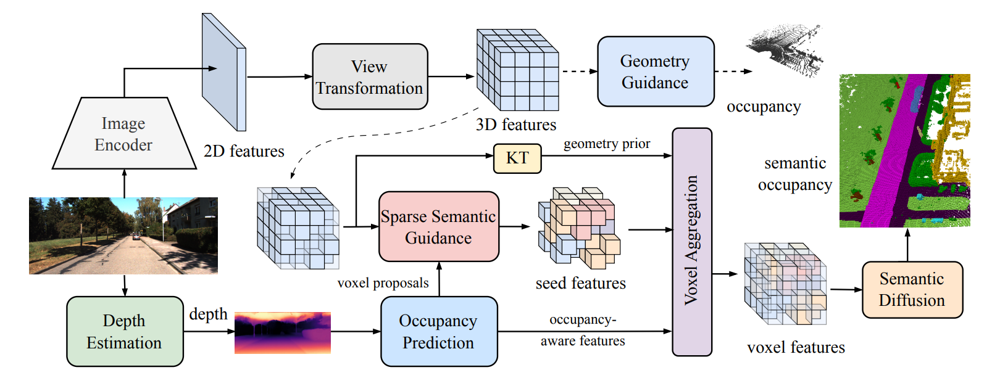

# FairScene

Official repository for the WACV 2026 paper:

**FairScene: Learning Class-Disentangled 2D/3D Representations for Semantic Scene Completion**
Dian Jia, Pei Yu, Wei Tang

📄 Paper: [openaccess](https://openaccess.thecvf.com/content/WACV2026/papers/Jia_FairScene_Learning_Class-Disentangled_2D3D_Representations_for_Semantic_Scene_Completion_WACV_2026_paper.pdf)
📍 Conference: WACV 2026

---

## Overview

FairScene is a framework for **camera-based semantic scene completion (SSC)** that learns **class-disentangled 2D/3D representations** to address challenges such as voxel class imbalance, occlusion, and depth ambiguity.

The framework introduces:

- Class-disentangled 2D-to-3D representation learning
- Inter-class occupancy reasoning
- OccMix: geometry-consistent data augmentation for SSC



---

## Repository layout

```
Fairescene/
├── projects/
│   ├── configs/
│   │   ├── _base_/                 # MMDetection base configs
│   │   └── fairescene/             # FairScene experiment configs (S-series)
│   └── mmdet3d_plugin/
│       ├── core/                   # evaluation hooks
│       ├── datasets/               # SemanticKITTI & KITTI-360 datasets
│       ├── fairescene/             # model: heads, detectors, modules, utils
│       └── models/                 # extra ops / optimizers
├── tools/                          # train / test entry points
└── preprocess/                     # depth / lidar / voxel preparation
```

---

## Installation

FairScene builds on **mmdetection3d v0.18.1** and the **VoxFormer** environment. We do not vendor these dependencies; install them externally.

```bash
# 1) Base env (CUDA 11.x + PyTorch 1.10 recommended)
conda create -n fairescene python=3.7 -y
conda activate fairescene
pip install torch==1.10.1+cu113 torchvision==0.11.2+cu113 \
            -f https://download.pytorch.org/whl/torch_stable.html

# 2) OpenMMLab stack (follow the VoxFormer install guide for exact versions)
pip install mmcv-full==1.4.0 -f https://download.openmmlab.com/mmcv/dist/cu113/torch1.10/index.html
pip install mmdet==2.14.0 mmsegmentation==0.14.1
git clone https://github.com/open-mmlab/mmdetection3d.git -b v0.18.1
cd mmdetection3d && pip install -e . && cd ..

# 3) Extra deps used by FairScene
pip install spconv-cu113 torch-scatter \
            -f https://data.pyg.org/whl/torch-1.10.1+cu113.html

# 4) (Optional) MaskDINO for mask-guided configs
git clone https://github.com/IDEA-Research/MaskDINO.git
# follow MaskDINO's install steps; the mask predictions are consumed by FairScene
```

---

## Data preparation

Download the datasets and arrange them as follows (these directories are gitignored):

```
Fairescene/
├── kitti/                          # SemanticKITTI
│   ├── dataset/sequences/{00..21}/{image_2,labels,calib.txt,...}
│   └── monoscene_label/            # MonoScene-style label preprocessing
├── kitti360/                       # SSCBench-KITTI-360
│   ├── data_2d_raw/
│   ├── msnet3d_depth/
│   └── preprocess/
└── ckpts/                          # pretrained backbones / mask models
    ├── resnet50-19c8e357.pth
    ├── maskdino_r50_50e_300q_panoptic_pq53.0.pth
    └── ...
```

Depth and lidar preprocessing scripts are under `preprocess/`. See `preprocess/README.md` for the full pipeline (MobileStereoNet → depth → pseudo lidar → voxelized labels).

---

## Configs

All experiment configs live in `projects/configs/fairescene/`:

| Config | Dataset | Backbone | Mask guidance |
|---|---|---|---|
| `fairescene-S-one-stage-guidance.py` | SemanticKITTI | ResNet-50 | none |
| `fairescene-S-one-stage-guidance-MaskDINO.py` | SemanticKITTI | ResNet-50 | MaskDINO |
| `fairescene-S-one-stage-guidance-MaskRCNN.py` | SemanticKITTI | ResNet-50 | Mask R-CNN |
| `fairescene-S-one-stage-guidance-Efficientnet_b7.py` | SemanticKITTI | EfficientNet-B7 | none |
| `fairescene-S-one-stage-guidance-kitti360.py` | KITTI-360 | ResNet-50 | none |
| `fairescene-S-one-stage-guidance-kitti360-MaskDINO.py` | KITTI-360 | ResNet-50 | MaskDINO |

---

## Training

```bash
# Single-GPU
python tools/train.py projects/configs/fairescene/fairescene-S-one-stage-guidance-MaskDINO.py

# Multi-GPU
./tools/dist_train.sh projects/configs/fairescene/fairescene-S-one-stage-guidance-MaskDINO.py 4
```

Checkpoints and logs are written to `work_dirs/<config-name>/` by default.

---

## Evaluation

```bash
# Single-GPU
python tools/test.py CONFIG CKPT --eval ssc

# Multi-GPU
./tools/dist_test.sh CONFIG CKPT 4 --eval ssc

# Hidden test (KITTI test server submission)
python tools/test_hidden.py CONFIG CKPT
```

---

## Citation

If you find this work useful, please cite:

```bibtex
@InProceedings{Jia_2026_WACV,
    author    = {Jia, Dian and Yu, Pei and Tang, Wei},
    title     = {FairScene: Learning Class-Disentangled 2D/3D Representations for Semantic Scene Completion},
    booktitle = {Proceedings of the IEEE/CVF Winter Conference on Applications of Computer Vision (WACV)},
    month     = {March},
    year      = {2026},
    pages     = {3760-3770}
}
```

---

## Acknowledgements

This codebase builds on [mmdetection3d](https://github.com/open-mmlab/mmdetection3d), [VoxFormer](https://github.com/NVlabs/VoxFormer), and [MaskDINO](https://github.com/IDEA-Research/MaskDINO). We thank the authors of these projects for open-sourcing their work.
